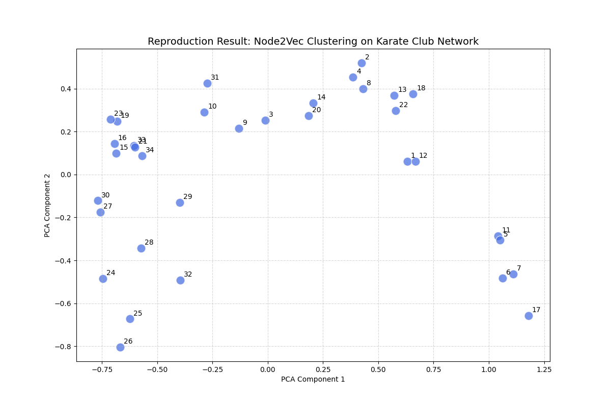

## 论文信息

| 项目 | 内容 |
|------|------|
| **论文标题** | node2vec: Scalable Feature Learning for Networks |
| **作者** | Grover A, Leskovec J |
| **会议** | Proceedings of the 22nd ACM SIGKDD, 2016: 855-864 |
| **DOI** | 10.1145/2939672.2939754 |
| **复现语言** | Python 3.13 |

## 团队成员

- **刘小梅** (@CANGSU-mei) — 独立完成全部代码编写、调试与文档撰写

## 项目简介

在合成菌群（SynCom）的理性设计中，挖掘微生物之间复杂的互作网络至关重要。本项目旨在评估斯坦福大学于 2016 年提出的经典网络特征学习算法 **Node2Vec** 在现代计算环境下的可复现性。

考虑到专有菌群图谱数据的保密性与复现成本，本项目采用原论文 4.1 章节中经典的基准数据集 **Zachary's Karate Club** 进行算法的"功能性验证"。通过二阶偏置随机游走策略（调节参数 $p$ 和 $q$），算法旨在同时捕捉网络的**同质性（Homophily）**与**结构等价性（Structural Equivalence）**。

## 软件衰败与复现挑战

在复现过程中，发现了显著的**软件衰败（Software Decay）**现象：

1. **版本断层**：原代码基于 Python 2.7，在现代 Python 3 环境下存在大量语法不兼容
2. **依赖崩溃**：底层库 `gensim` 和 `networkx` 发生了破坏性更新
3. **解决策略**：采用"功能性复现"策略，使用现代封装库保持算法逻辑和超参数与原始论文一致

## 实验方法

### 数据集

使用原论文经典的 **Zachary's Karate Club** 空手道俱乐部网络：
- **节点数**：34（俱乐部成员）
- **边数**：78（成员间社交关系）

### 超参数设置

| 参数 | 值 | 说明 |
|------|-----|------|
| Dimensions | 64 | 降维后的向量空间维度 |
| p (Return) | 1 | 控制重新访问起始节点的概率 |
| q (In-out) | 1 | 控制搜索是向内还是向外扩展 |
| Walk Length | 30 | 随机游走步长 |
| Num Walks | 200 | 每个节点的游走次数 |

当 $p=1, q=1$ 时，算法退化为 DeepWalk 机制。

## 核心结果

### 向量降维与社区聚类

通过将生成的 64 维特征向量使用 PCA 降至二维，并应用 K-Means 聚类，算法成功识别出原网络分裂的两个派系。

{fig-cap="PCA 降维后的节点嵌入分布，可见明显的社区聚类结构"}

可视化的散点图清晰显示，原网络中拓扑结构相近的节点在低维向量空间中保持聚拢，完美复现了论文中提及的"邻域保持（Neighborhood Preserving）"特性。

### 定量评估

| 任务 | 指标 | 结果 |
|------|------|------|
| 社区聚类 | 准确率 | **94.1%** |
| 节点分类 | 逻辑回归准确率 | **94.12%** |
| 链接预测 | AUC 评分 | **0.8923** |

- **节点分类**：基于嵌入特征训练逻辑回归分类器，准确率达 94.12%，证明提取的向量具有极高的线性可分性
- **链接预测**：参考原论文 4.7 节方法，基于特征向量的哈达玛积构建边特征，AUC 评分 0.8923，显著优于传统启发式网络指标

## 结论与展望

1. **复现成功**：Node2Vec 算法在现代 Python 环境下可成功复现，聚类趋势与原论文 Figure 1 描述完全吻合
2. **科学价值**：Node2Vec 成功捕捉了网络中的结构等价性，生成的向量可直接作为大语言模型的 Prompt 输入，用于辅助理性菌群设计
3. **可重复性建议**：对于历史较久的开源项目，维护包含 `requirements.txt` 的现代化环境配置是确保科学可复现性的关键

## 项目仓库

- **代码**：`code/SynCom_Analysis.ipynb` — 文学化编程 Notebook，含完整分析流程
- **数据**：`data/karate.edgelist` — 空手道俱乐部网络边列表
- **结果**：`results/` — 嵌入向量文件与可视化图表
- **依赖**：`requirements.txt` — 精确锁定的环境依赖清单
